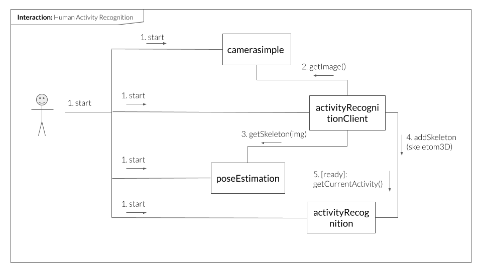

```
```
#
``` activityRecognition
```
This component predicts human activity based on the sequence of human skeletons (set of a human joints, can also be referred to as the pose).  
The component implements interface ActivityRecognition. It provides two functions: addSkeleton() which expects an array of shape (3, 15) for xyz positions of 
15 joints, and getCurrentActivity(), which returns a json string of top activities with their probabilities.  
The component requires a minimum of 32 skeletons to produce a prediction.  
The component can be run together with activityRecognitionClient, poseEstimation and camerasimple components to produce predictions based on the real-time input. Check the communication diagram below.

## Requirements

python2  

then install with pip (pip install name):  

numpy  
matplotlib  
PyTorch (>=0.4.0)
torchnet
openpyxl  


## Configuration parameters
As any other component,
``` *activityRecognition* ```
needs a configuration file to start. In

    etc/config

Make sure that number of the port of activityRecognition.Endpoints is the same as the corresponding number of the client component using the activityRecognition component.


    
## Starting the component
To run the code from activityRecognition directory:

```shell
python src/activityRecognition.py --Ice.Config=etc/config
```

## Training activity recognition model

Inside of the component directory you will find the training code for producing a convolutional neural network (```dl_training```) that is used by this component to produce predictions. Follow the README inside of the ```dl_training``` folder if you want to train your own model. Once you have your model, replace the default model ```src/data/best.pth.tar``` with your own ```*.pth.tar``` file. 

## Additional Information

The component also contains specificworkerSVM.py which can be used instead of the default specificworker.py. It uses SVM instead of CNN. In this case Scikit-Learn library is required. However the SVM classifier does not generalize. There's also a ```SVM_hand_crafted``` folder inside of the component, which provides the code for feature extraction and fitting SVM model. 

## Communication diagram

